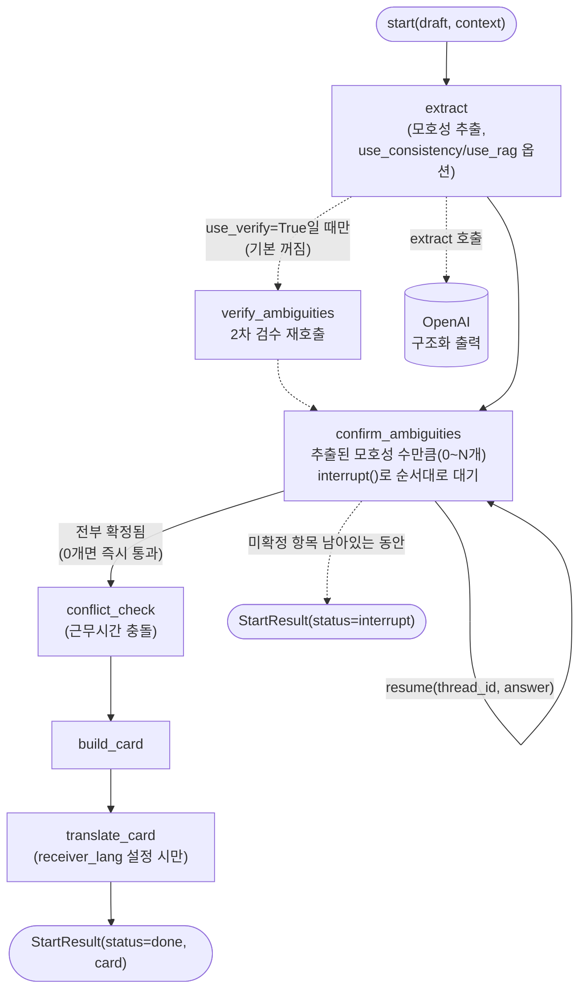
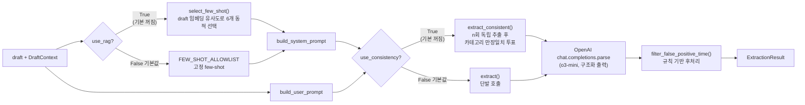

# ditto: 오해 방지 레이어 (Misunderstanding Prevention Layer)

멋쟁이사자처럼 14기 중앙해커톤 "보더리스 협업" 트랙 · AI 모델 파트

---

## 개요

Slack·Teams 등 협업툴 위에 붙는 AI 플러그인형 B2B SaaS다. 비동기 메시지의 시간·요청
의도·결정 상태 모호성을 감지해, 발신자가 스스로 의도를 확인한 뒤 수신자에게 명시적인
업무 조건으로 전달하도록 돕는다.

메시지 하나를 넣으면:
1. TIME(모호한 기한) / REQUEST_INTENT(완곡한 의사표현) / DECISION_STATUS(조직마다
   다른 "완료"의 뜻) 세 카테고리로 모호성을 감지한다.
2. 모호성이 있으면 LangGraph `interrupt()`로 멈춰서 발신자가 직접 확정하게 한다.
   모호성이 없으면 안 멈추고 바로 진행한다(불필요한 확인 요청을 만들지 않는다는 원칙).
3. 확정된 내용으로 수신자용 "공동 이해 카드"를 만들어 반환한다(시간대 변환, 근무시간
   충돌 검사, 필요 시 번역까지 포함).

**이 저장소는 AI 모델(LLM 프롬프트 + LangGraph 에이전트) 파트만 다룬다.** FastAPI
라우터/DB/프론트엔드는 다른 팀원이 별도 저장소에서 관리한다.

---

## 관련 연구

이 프로젝트가 방법론을 가져온 선행 연구·프레임워크와의 관계.

| 연구/도구 | 접근 방법 | 이 프로젝트에 채택한 것 |
|---|---|---|
| Meyer (2014), *The Culture Map* [1] | 문화 간 업무 스타일 차이를 8개 축으로 유형화 | Scheduling/Evaluating/Disagreeing/Communicating 4개 축을 채택해 TIME/REQUEST_INTENT/DECISION_STATUS 카테고리 설계의 뼈대로 사용. 나머지(Communicating)는 실측 결과로 제외(아래 실험 결과 참고) |
| Kuhn, Gal & Farquhar (2022), CLAM [2] | 모호한 질문에 선택적으로 되묻는(selective clarification) LLM 평가 방식 | ambiguous/explicit **쌍(pair)** 구조로 골든셋을 설계해 recall·precision을 동시에 측정하는 방식을 채택 |
| Zhou et al. (2023) [3] | few-shot 예시가 평가셋에 그대로 재사용되는 "prompt contamination" 문제 제기 | `culture_criteria.py`의 few-shot 문장을 골든셋에 그대로 쓰지 않고 패러프레이즈해 유출을 방지(아래 실험 결과의 RAG 유출 사례가 이 문제를 실제로 재현) |
| Jin et al. (2024), KoBBQ [4] | 한국어 편향 벤치마크를 위한 3단계 문화 적응 분류(Simply-Transferred / Target-Modified / Sample-Removed) | 판단기준표 항목을 "그대로 이식 가능" / "한국 맥락에 맞게 재구성" / "제외"로 분류하는 방법론만 차용(데이터셋 자체는 사용하지 않음) |
| Sewon Min et al. (2020), AmbigQA [5] | ambiguous/clear 균형 잡힌 held-out 테스트셋 구성 | 설계 검토 단계에서 참고했으나, 최종적으로는 CLAM의 pair 방식을 채택 |

**이 프로젝트의 차별점**: 위 선행 연구들은 문화 차이 유형화(Meyer)나 모호성 평가
방법론(CLAM, AmbigQA)을 각각 독립적으로 다루지만, 실제 비동기 협업 메시지에
**실시간으로 개입**해 발신자에게 되묻고 구조화된 카드로 변환까지 하는 end-to-end
파이프라인으로 엮은 사례는 확인되지 않았다. 또한 판단기준표 설계에 문헌만이 아니라
자체 설문(n=12~15)·인터뷰 실측을 더해, 문헌이 말하는 "국가 문화"와 실제 국내
응답자의 반응이 갈리는 지점을 최소 6개 항목에서 직접 확인했다(아래 방법론 참고).

---

## 방법론

### 아키텍처



`extract`는 그래프 진입점에서 항상 한 번 실행되고, `confirm_ambiguities`로 무조건
넘어간다(그래프 수준의 "모호성 있음?" 분기 노드는 없다). `confirm_ambiguities` 안의
루프가 추출된 모호성 개수(보통 0~2개)만큼 `interrupt()`를 순서대로 호출하고, 재개
(`resume`) 때마다 같은 노드가 처음부터 다시 실행되며 이미 답한 항목은 캐시된 값으로
건너뛴다. 모호성이 0개면 루프가 아예 안 돌아 멈추지 않고 바로 `conflict_check`로
진행한다. `verify_ambiguities`는 `use_verify=True`일 때만 `extract`와
`confirm_ambiguities` 사이에 끼는 선택적 2차 검수 노드인데, 실측에서 precision을
0.679→0.500으로 오히려 악화시켜(`graph/build.py`) 기본값은 꺼져 있다.

#### `extract` 노드 내부



`use_rag`(동적 few-shot 선택)와 `use_consistency`(self-consistency 다수결)는 둘 다
`LLMClient` 생성 시점의 옵션이며 기본값은 둘 다 꺼짐이다. 둘 모두 golden set 실측에서
baseline보다 나빴거나(RAG는 정답 유출, 아래 실험 결과 참고) recall을 깎아먹는
트레이드오프가 있어서(self-consistency) 기본 파이프라인에서는 쓰지 않는다. 응답이
오면 규칙 기반 후처리(`postfilter.py`)로 명시적 시각 표현이 TIME 모호성으로 잘못
잡힌 케이스를 걸러낸다. API 호출 없이 코드로만 처리해 정밀도를 올리는 마지막 단계다.

### 트랙 경계(Border) 대응

멋쟁이사자처럼 트랙이 정의한 4개 경계(지리/문화/조직/언어) 기준으로 이 패키지가 실제로
커버하는 범위다.

| Border | 대응 방식 |
|---|---|
| 지리 | TIME 카테고리 + `graph/conflict.py`(근무시간 충돌 검사) |
| 문화 | REQUEST_INTENT(완곡한 반대 표현 등. 문헌 근거가 4개 카테고리 중 가장 탄탄) |
| 조직 | DECISION_STATUS를 `DECISION_STATUS_VOCABULARY`(6개 정규화 상태값)로 **정규화**해 "승인"/"완료"/"컨펌"의 조직별 뜻 차이를 흡수 |
| 언어 | `DraftContext.receiver_lang` 설정 시 `translate_card_node`가 카드의 자유 텍스트 필드만 번역, 구조화된 값(타임스탬프·정규화된 상태)은 그대로 둠 |

**Communicating(톤/맥락 해석)은 의도적으로 스코프에서 제외했다.** 골든셋 실측에서
다른 카테고리 대비 recall이 크게 낮았고, 최고 성능 LLM도 간접화법·톤 해석은 사람 수준에
못 미친다는 문헌 근거까지 확인됐다(`docs/culture-criteria.md` 부록 참고).

**번역은 모호성 확정 이후에만 한다.** 먼저 번역하면 번역기가 여러 해석 중 하나를
암묵적으로 골라버려서, 발신자가 명시적으로 확정하기 전에 모호성이 사라져버린다(이
프로젝트의 핵심 원칙 위반). `evidence`(원문)는 번역하지 않고 그대로 둔다.

### 판단기준표 & 데이터셋 구성

모호성 판단 근거는 **[`docs/culture-criteria.md`](docs/culture-criteria.md)** 의
TIME/REQUEST_INTENT/DECISION_STATUS 16개 항목(OTHER 4개는 위 이유로 제외)이다. 문헌
조사에 이어 설문(직장인·학생 대상, 세 축 각각 n=12~15)과 한국·호주·미국 근무 경험이
있는 현직 개발자 인터뷰로 1차 검증했다. 이 중 6개 항목(F03/F04, D01/D03/D05)은 문헌이
예측한 것과 실제 국내 응답자 반응이 반대로 나와, "모호함"에서 "국내에선 이미 수렴돼
있지만 조직/문화 경계를 넘을 때 리스크가 되는 표현"으로 재분류했다(상세는
`docs/culture-criteria.md`의 각 항목 노트).

이 16개 항목을 기반으로 골든셋(`agent/data/golden.json`, 36케이스)을 만들었다.

| 구성 | 케이스 수 | 설계 |
|---|---|---|
| TIME(T01~T05) | 5쌍(10케이스) | 상대적 기한 표현 vs 명시적 일시 |
| REQUEST_INTENT(F01~F06) | 6쌍(12케이스) | 완곡한 의사표현 vs 명확한 의사표현 |
| DECISION_STATUS(D01~D05) | 5쌍(10케이스) | 조직마다 다른 "완료"의 뜻 vs 정규화된 명시 표현 |
| C02(시간대만 있는 엣지 케이스) | 1쌍(2케이스) | TIME 단독 신호 검증 |
| COMP-01/02 | 2케이스 | 여러 카테고리가 한 메시지에 동시 등장하는 복합 케이스 |

각 쌍은 **ambiguous**(모호성이 있어야 정답) / **explicit**(같은 주제를 완전히 명시적인
표현으로 바꿔 쓴 대조군, 모호성이 없어야 정답)로 구성했다(CLAM [2]의 pair 설계 방식).
이 대조 설계 덕분에 recall(진짜 모호한 걸 놓치지 않는지)과 precision(이미 명확한 걸
과탐지하지 않는지)을 golden set 하나로 동시에 측정한다.

---

## 실험 결과

**최종 채택**: o3-mini + 규칙 기반 TIME 후처리 필터(명시적 시각 문장 오탐 제거, API
호출 없음). 골든셋 36케이스 기준 **recall 0.810 / precision 0.761**.

| 실험 | 조건 | recall | precision | 결론 |
|---|---|---|---|---|
| baseline | o3-mini, 규칙 필터만 | **0.810** | 0.761 | **최종 채택** |
| self-consistency | 위 + 같은 메시지 3회 독립 추출, 카테고리 만장일치 다수결 | 0.746 | **0.825** | recall↓/precision↑ 트레이드오프 확인(조건당 3회 반복 측정, pooled n=108로 검증). 응답 지연 3배라 옵션으로만 유지 |
| RAG(동적 few-shot) | 판단기준표 16개를 draft 유사도로 동적 선택 | 0.619~0.762 | 0.619~0.800 | 모든 조합에서 baseline보다 나쁨. 기각 |

**오해 방지 도구는 recall을 precision보다 우선했다.** 모호성을 놓치는 것(FN)은 조용히
실패해서 나중에 진짜 오해로 이어지지만, 과탐지(FP)는 확인 한 번 더 누르는 정도라
훨씬 덜 치명적이라는 판단이다.

**방법론적으로 짚을 것 (prompt contamination 재현)**: RAG를 처음 측정했을 때는 recall
1.000/precision 0.875까지 나와 채택할 뻔했으나, golden set의 ambiguous 케이스가
판단기준표 항목의 패러프레이즈로 만들어져 있어서 RAG가 draft와 유사도로 few-shot을
고르면 **자기 자신이 정답으로 그대로 선택되는 유출**이 있었다(17개 중 13개, 76%). 이는
Zhou et al. [3]이 경고한 prompt contamination이 실제로 재현된 사례다. leave-one-out
(자기 자신 제외)으로 유출을 막고 재측정하니 모든 조합에서 오히려 baseline보다 나빴다.
후보 풀이 16개뿐이라 "draft와 비슷한 것"과 "카테고리를 골고루 커버하는 것"이 충돌하는
게 원인으로 확인됐다(고정 few-shot은 항상 TIME/REQUEST_INTENT/DECISION_STATUS 2-2-2
균형을 유지하지만 RAG는 자주 한 카테고리를 0개로 만든다).

---

## 설치 및 실행

```bash
cd agent
cp .env.example .env   # DITTO_LLM_MODE=mock이면 OPENAI_API_KEY 없이도 동작
uv sync
uv run pytest
uv run python examples/cli_demo.py   # 서버 없이 터미널에서 전체 흐름 확인
```

골든셋 평가(`uv run ditto-eval`), rate-limit 대응, `configure()`/`start()`/`resume()`
전체 API 스펙, 프로덕션 배선 방법은 **[`agent/README.md`](agent/README.md)** 에 있다.
이 저장소와의 유일한 통합 접점이다.

---

## 파일 구조

```
ditto/
├── README.md                    # 이 문서
├── agent/                       # 전부 여기. LangGraph 에이전트 패키지
│   ├── README.md                #   API 스펙, 프로덕션 배선, 정확도 옵션
│   ├── src/ditto_agent/         #   graph/, llm/, eval/ 등
│   ├── data/golden.json         #   골든셋 36케이스
│   ├── examples/cli_demo.py     #   서버 없이 전체 흐름 확인
│   └── tests/
└── docs/
    ├── culture-criteria.md      # 판단기준표 16항목 + 설문/인터뷰 근거
    └── backend-handoff.md       # 백엔드 연동 체크리스트
```

---

## 한계 및 향후 연구

**실사용 트래픽 기반 검증 없음**: 판단기준표 16개 항목은 설문(n=12~15)·인터뷰로
1차 검증했지만, 실제 협업툴 트래픽으로 재검증한 적은 없다.

**골든셋 표본 크기**: 36케이스로 표본이 작아 recall/precision 절대값에 노이즈가 크다
(같은 설정으로 반복 측정해도 ±0.05~0.1 흔들림 확인됨). QA 기간 동안 골든셋을
확장해서(few-shot 풀과 안 겹치는 새 문장으로, 정답 유출 방지) 더 큰 표본으로
재검증할 계획이다.

**근무시간 충돌 검사가 placeholder**: `graph/conflict.py`의 `default_conflict_checker`는
9~18시를 하드코딩한 것이라 진짜 근무시간표·공휴일을 모른다. 프로덕션에서는 반드시
`configure(conflict_checker=...)`로 실제 조회 로직으로 교체해야 한다.

**메시지 단위 번역은 스코프 밖**: `translate_card_node`는 카드 필드만 번역한다.
채팅 스레드의 개별 메시지 번역은 다루지 않는다(팀원 프론트 쪽 관심사일 수 있음).

---

## 추가 문서

- [판단기준표(culture-criteria.md)](docs/culture-criteria.md): TIME/REQUEST_INTENT/
  DECISION_STATUS 16개 항목의 문헌 근거와 설문·인터뷰 검증 결과
- [백엔드 연동 체크리스트](docs/backend-handoff.md): 무엇을 넘기고 무엇을 직접
  구현해야 하는지
- [agent/README.md](agent/README.md): API 스펙, 정확도 옵션, 프로덕션 배선 전체 레퍼런스

## 참고 문헌

- [1] E. Meyer, *The Culture Map: Breaking Through the Invisible Boundaries of Global Business*, PublicAffairs, 2014.
- [2] L. Kuhn, Y. Gal, & S. Farquhar, "CLAM: Selective Clarification for Ambiguous Questions with Generative Language Models," *arXiv:2212.07769*, 2022.
- [3] K. Zhou et al., "Don't Make Your LLM an Evaluation Benchmark Cheater," *arXiv:2311.01964*, 2023.
- [4] J. Jin et al., "KoBBQ: Korean Bias Benchmark for Question Answering," *TACL*, 2024, arXiv:2307.16778.
- [5] S. Min et al., "AmbigQA: Answering Ambiguous Open-domain Questions," *EMNLP*, 2020.
