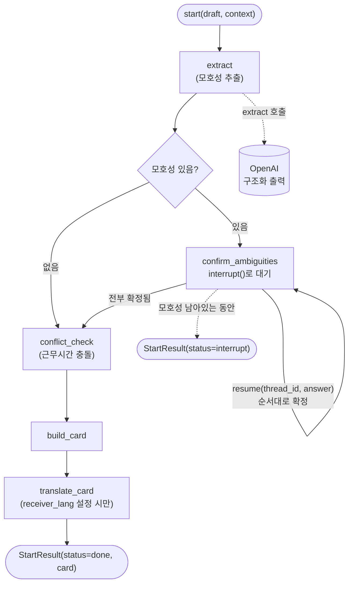
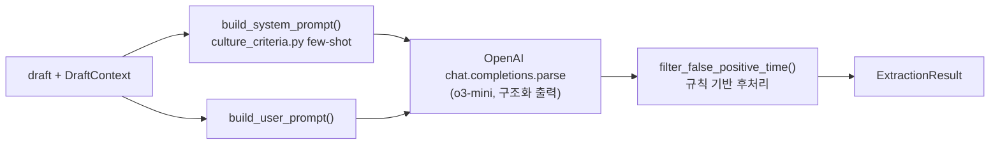

# ditto — 오해 방지 레이어 (Misunderstanding Prevention Layer)

Slack·Teams 등 협업툴 위에 붙는 AI 플러그인형 B2B SaaS. 비동기 메시지의 시간·요청
의도·결정 상태 모호성을 감지해, 발신자가 스스로 의도를 확인한 뒤 수신자에게 명시적인
업무 조건으로 전달하도록 돕는다. 멋쟁이사자처럼 14기 중앙해커톤 "보더리스 협업" 트랙
프로젝트.

**이 저장소는 AI 모델(LLM 프롬프트 + LangGraph 에이전트) 파트만 다룬다.** FastAPI
라우터/DB/프론트엔드는 다른 팀원이 별도 저장소에서 관리한다.

## 구조

```
agent/    ← 전부 여기. LangGraph 에이전트, 골든셋 평가 하네스, 테스트.
docs/     ← 판단기준표(문화/조직 경계 대응 근거), 백엔드 핸드오프 체크리스트
```

## 무엇을 하는가

메시지 하나를 넣으면:
1. TIME(모호한 기한) / REQUEST_INTENT(완곡한 의사표현) / DECISION_STATUS(조직마다
   다른 "완료"의 뜻) 세 카테고리로 모호성을 감지
2. 모호성이 있으면 LangGraph `interrupt()`로 멈춰서 발신자가 직접 확정하게 함
   (모호성이 없으면 안 멈추고 바로 진행. 불필요한 확인 요청을 만들지 않는다는 원칙)
3. 확정된 내용으로 수신자용 "공동 이해 카드"를 만들어 반환(시간대 변환, 근무시간
   충돌 검사, 필요 시 번역까지 포함)

## 아키텍처



메시지 하나가 `extract`에서 시작해 모호성 개수만큼(보통 0~2개) `confirm_ambiguities`에서
순서대로 멈췄다 재개되고, 전부 확정되면 `conflict_check`(근무시간 충돌 검사) →
`build_card`(카드 생성) → `translate_card`(수신자 언어 설정 시만 번역)를 거쳐 끝난다.

### `extract` 노드 내부



draft와 판단기준표(`culture_criteria.py`)에서 뽑은 few-shot 예시로 시스템 프롬프트를
만들어 OpenAI 구조화 출력 호출을 하나 보내고, 응답이 오면 규칙 기반 후처리
(`postfilter.py`)로 명시적 시각 표현이 TIME 모호성으로 잘못 잡힌 케이스를 걸러낸다.
API 호출 없이 코드로만 처리해 정밀도를 올리는 마지막 단계다.

## 트랙 경계(Border) 대응

멋쟁이사자처럼 트랙이 정의한 4개 경계(지리/문화/조직/언어) 기준으로 이 패키지가 실제로
커버하는 범위:

| Border | 대응 방식 | 새 UI 필요 여부 |
|---|---|---|
| 지리 | TIME 카테고리 + `graph/conflict.py`(근무시간 충돌 검사) | 불필요. 기존 카드의 `기한` 필드로 표현 |
| 문화 | REQUEST_INTENT(완곡한 반대 표현 등. 문헌 근거가 4개 카테고리 중 가장 탄탄) | 불필요 |
| 조직 | DECISION_STATUS를 `DECISION_STATUS_VOCABULARY`(6개 정규화 상태값)로 **정규화**해 "승인"/"완료"/"컨펌"의 조직별 뜻 차이를 흡수 | 불필요. 기존 `결정 상태` 필드로 표현 |
| 언어 | `DraftContext.receiver_lang` 설정 시 `translate_card_node`가 카드의 자유 텍스트 필드만 번역, 구조화된 값(타임스탬프·정규화된 상태)은 그대로 둠 | 불필요. 같은 카드 필드, 값만 로컬라이즈 |

**Communicating(톤/맥락 해석)은 의도적으로 스코프에서 제외했다.** 골든셋 실측에서
다른 카테고리 대비 recall이 크게 낮았고, 최고 성능 LLM도 간접화법·톤 해석은 사람 수준에
못 미친다는 문헌 근거까지 확인됐다(`docs/culture-criteria.md` 부록 참고).

**번역은 모호성 확정 이후에만 한다.** 먼저 번역하면 번역기가 여러 해석 중 하나를
암묵적으로 골라버려서, 발신자가 명시적으로 확정하기 전에 모호성이 사라져버린다(이
프로젝트의 핵심 원칙 위반). `evidence`(원문)는 번역하지 않고 그대로 둔다.

## 판단기준표 & 데이터셋 구성

모호성 판단 근거는 **[`docs/culture-criteria.md`](docs/culture-criteria.md)** 의
TIME/REQUEST_INTENT/DECISION_STATUS 16개 항목(OTHER 4개는 위 이유로 제외). 문헌 조사에
이어 설문(직장인·학생 대상, 세 축 각각 n=12~15)과 한국·호주·미국 근무 경험이 있는 현직
개발자 인터뷰로 1차 검증했다.

이 16개 항목을 기반으로 골든셋(`agent/data/golden.json`, 36케이스)을 만들었다:

| 구성 | 케이스 수 | 설계 |
|---|---|---|
| TIME(T01~T05) | 5쌍(10케이스) | 상대적 기한 표현 vs 명시적 일시 |
| REQUEST_INTENT(F01~F06) | 6쌍(12케이스) | 완곡한 의사표현 vs 명확한 의사표현 |
| DECISION_STATUS(D01~D05) | 5쌍(10케이스) | 조직마다 다른 "완료"의 뜻 vs 정규화된 명시 표현 |
| C02(시간대만 있는 엣지 케이스) | 1쌍(2케이스) | TIME 단독 신호 검증 |
| COMP-01/02 | 2케이스 | 여러 카테고리가 한 메시지에 동시 등장하는 복합 케이스 |

각 쌍은 **ambiguous**(모호성이 있어야 정답) / **explicit**(같은 주제를 완전히 명시적인
표현으로 바꿔 쓴 대조군, 모호성이 없어야 정답)로 구성했다. 이 대조 설계 덕분에
recall(진짜 모호한 걸 놓치지 않는지)과 precision(이미 명확한 걸 과탐지하지 않는지)을
golden set 하나로 동시에 측정한다.

## 실험 결과: 최종 설정과 근거

**최종 채택**: o3-mini + 규칙 기반 TIME 후처리 필터(명시적 시각 문장 오탐 제거, API
호출 없음). 골든셋 36케이스 기준 **recall 0.810 / precision 0.761**.

| 실험 | 조건 | recall | precision | 결론 |
|---|---|---|---|---|
| baseline | o3-mini, 규칙 필터만 | **0.810** | 0.761 | **최종 채택** |
| self-consistency | 위 + 같은 메시지 3회 독립 추출, 카테고리 만장일치 다수결 | 0.746 | **0.825** | recall↓/precision↑ 트레이드오프 확인(반복 측정으로 검증), 응답 지연 3배라 옵션으로만 유지 |
| RAG(동적 few-shot) | 판단기준표 16개를 draft 유사도로 동적 선택 | 0.619~0.762 | 0.619~0.800 | 모든 조합에서 baseline보다 나쁨. 기각 |

**오해 방지 도구는 recall을 precision보다 우선했다.** 모호성을 놓치는 것(FN)은 조용히
실패해서 나중에 진짜 오해로 이어지지만, 과탐지(FP)는 확인 한 번 더 누르는 정도라
훨씬 덜 치명적이라는 판단이다.

**방법론적으로 짚을 것**: RAG를 처음 측정했을 때는 recall 1.000/precision 0.875까지
나와 채택할 뻔했으나, golden set의 ambiguous 케이스가 판단기준표 항목의 패러프레이즈로
만들어져 있어서 RAG가 draft와 유사도로 few-shot을 고르면 **자기 자신이 정답으로 그대로
선택되는 유출**이 있었다(17개 중 13개, 76%). leave-one-out(자기 자신 제외)으로 유출을
막고 재측정하니 모든 조합에서 오히려 baseline보다 나빴다. 후보 풀이 16개뿐이라 "draft와
비슷한 것"과 "카테고리를 골고루 커버하는 것"이 충돌하는 게 원인으로 확인됐다(고정
few-shot은 항상 TIME/REQUEST_INTENT/DECISION_STATUS 2-2-2 균형을 유지하지만 RAG는 자주
한 카테고리를 0개로 만든다). self-consistency 트레이드오프도 단일 실행 노이즈와
구분하기 위해 조건당 3회씩 반복 측정(pooled n=108)한 뒤 채택/기각을 결정했다.

## 시작하기

```bash
cd agent
cp .env.example .env   # DITTO_LLM_MODE=mock이면 OPENAI_API_KEY 없이도 동작
uv sync
uv run pytest
uv run python examples/cli_demo.py   # 서버 없이 터미널에서 전체 흐름 확인
```

골든셋 평가(`uv run ditto-eval`), rate-limit 대응, `configure()`/`start()`/`resume()`
전체 API 스펙, 프로덕션 배선 방법은 **[`agent/README.md`](agent/README.md)** 에 있다.
이 저장소와의 유일한 통합 접점.

## 현재 상태 / 아직 안 채운 부분

- 판단기준표 16개 항목은 설문(n=12~15)·인터뷰 1차 검증은 됐지만, 실사용 트래픽
  기반 검증은 아직 없다.
- 골든셋이 36케이스로 표본이 작아 recall/precision 절대값에 노이즈가 크다(같은
  설정으로 반복 측정해도 ±0.05~0.1 흔들림 확인됨). QA 기간 동안 골든셋을 확장해서
  (few-shot 풀과 안 겹치는 새 문장으로, 정답 유출 방지) 더 큰 표본으로 재검증할 계획.
- `graph/conflict.py`의 `default_conflict_checker`는 진짜 근무시간표/공휴일을 모른다.
  프로덕션에서는 반드시 `configure(conflict_checker=...)`로 교체해야 한다.
- `translate_card_node`는 카드 필드만 번역한다. 채팅 스레드의 개별 메시지 번역은
  스코프 밖(팀원 프론트 쪽 관심사일 수 있음).

## 백엔드 연동

**[`docs/backend-handoff.md`](docs/backend-handoff.md)**: 무엇을 넘기고 무엇을
직접 구현해야 하는지 체크리스트.
