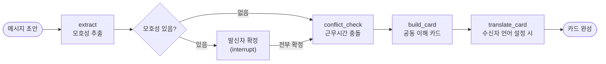

# Ditto Agent

발신자가 보낸 비동기 메시지에서 시간·요청 의도·결정 상태의 모호성을 감지하고, 발신자가 실제 의도를 확정한 뒤 수신자에게 명시적인 업무 조건으로 전달하는 오해 방지 에이전트입니다. 멋쟁이사자처럼 14기 중앙해커톤 "보더리스 협업" 트랙 프로젝트 Ditto의 AI 모델 파트입니다.

## 문제와 접근

시차·언어·업무 규범이 다른 글로벌 팀은 비동기 텍스트로 업무를 요청할 때 마감, 요청 의도, 결정 상태를 각자의 맥락으로 해석합니다. 이 해석 차이는 메시지를 보낸 순간이 아니라 실제 작업이 시작되거나 결과물을 확인한 뒤에야 드러나 재작업과 신뢰 손상으로 이어집니다.

이 에이전트는 AI가 국가나 문화를 임의로 판단해 답을 정해주는 방식 대신, 해석이 갈릴 수 있는 지점과 빠진 조건만 짚어주고 최종 확정은 항상 사람이 하도록 설계했습니다. 모호성이 없으면 개입하지 않는 것도 핵심 원칙입니다 — 과도한 확인 요청은 오히려 사용자가 AI 검토 기능 자체를 꺼버리게 만들기 때문입니다.

## 동작 방식

메시지 하나는 `extract`(모호성 추출)에서 시작해, 발견된 모호성 개수만큼(보통 0~2개) `confirm_ambiguities`에서 `interrupt()`로 멈췄다 재개되며 발신자가 순서대로 확정합니다. 전부 확정되면 `conflict_check`(근무시간 충돌 검사) → `build_card`(공동 이해 카드 생성) → `translate_card`(수신자 언어 설정 시에만 번역)를 거쳐 끝납니다.



`extract` 노드는 OpenAI 구조화 출력(o3-mini)으로 업무·담당자·기한·요청 유형·결정 상태를 뽑아내면서, 자체 구축한 판단기준표(`culture_criteria.py`)의 few-shot 예시를 근거로 모호성 후보를 함께 판단합니다. 이후 명시적 시각 표현이 모호성으로 잘못 잡히는 오탐은 API 호출 없는 규칙 기반 후처리로 한 번 더 걸러냅니다.

두 가지 원칙을 코드 레벨에서 강제합니다. 첫째, 모호성이 하나라도 남아있으면 그래프 실행 자체를 멈춰 발신자가 확정하기 전에는 절대 자동으로 넘어가지 않습니다. 둘째, 번역은 모든 모호성이 확정된 뒤에만 실행합니다 — 먼저 번역하면 번역기가 여러 해석 중 하나를 암묵적으로 골라버려서 발신자가 명시적으로 확정하기 전에 모호성이 사라지기 때문입니다. 이때 원문(`evidence`)은 번역하지 않고 그대로 남깁니다.

조직마다 다르게 쓰이는 "승인" · "완료" · "컨펌" 같은 결정 상태 표현은 6개 정규화 값(최종 확정 / 임시 시도 / 1차 완료 / 제안 / 보류 / 미정)으로 매핑해 조직 간 표현 차이를 흡수합니다.

## 4개 경계(Border) 대응

멋쟁이사자처럼 트랙이 정의한 지리·문화·조직·언어 4개 경계를 이 패키지가 실제로 어떻게 커버하는지 정리하면 다음과 같습니다.

| Border | 대응 방식 |
|---|---|
| 지리 | TIME 카테고리 감지 + 근무시간 충돌 검사(`conflict.py`) — 기존 카드의 '기한' 필드로 표현 |
| 문화 | REQUEST_INTENT(완곡한 의사표현 감지) — 4개 카테고리 중 문헌 근거가 가장 탄탄한 항목 |
| 조직 | DECISION_STATUS를 6개 정규화 값으로 매핑해 "완료"의 조직별 의미 차이를 흡수 |
| 언어 | `receiver_lang` 설정 시 카드의 자유 텍스트 필드만 번역, 구조화된 값(타임스탬프·정규화 상태)은 그대로 유지 |

톤·맥락 해석(Communicating)은 의도적으로 스코프에서 제외했습니다. 골든셋 실측에서 다른 카테고리 대비 recall이 크게 낮았고, 최고 성능 LLM도 간접화법·톤 해석은 사람 수준에 못 미친다는 문헌 근거를 확인했기 때문입니다.

## 정확도 검증

판단 근거인 16개 항목(TIME·REQUEST_INTENT·DECISION_STATUS)을 기반으로 골든셋 36케이스를 구성했습니다. 각 항목을 모호성이 있어야 정답인 ambiguous 케이스와, 같은 주제를 완전히 명시적인 표현으로 바꿔 쓴 explicit 대조군으로 쌍을 이뤄, 이 대조 설계 하나로 recall(놓치지 않는지)과 precision(과탐지하지 않는지)을 동시에 측정했습니다.

| 실험 | 조건 | recall | precision | 결론 |
|---|---|---|---|---|
| baseline | o3-mini + 규칙 기반 후처리 | 0.810 | 0.761 | 최종 채택 |
| self-consistency | 동일 메시지 3회 독립 추출 후 다수결 | 0.746 | 0.825 | precision은 오르지만 recall이 떨어지고 응답 지연이 3배라 옵션으로만 유지 |
| RAG(동적 few-shot) | 판단기준표를 draft 유사도로 동적 선택 | 0.619~0.762 | 0.619~0.800 | 모든 조합에서 baseline보다 낮아 기각 |

오해 방지 도구는 모호성을 놓치는 것(FN)이 조용히 실패해 나중에 진짜 오해로 이어지는 반면, 과탐지(FP)는 확인을 한 번 더 누르는 정도로 덜 치명적이라고 판단해 recall을 precision보다 우선했습니다.

RAG 실험은 한 차례 recall 1.000 / precision 0.875까지 나와 채택할 뻔했으나, 골든셋의 ambiguous 케이스가 판단기준표 항목의 패러프레이즈로 만들어져 있어 RAG가 draft와의 유사도로 few-shot을 고르면 자기 자신이 정답으로 그대로 선택되는 유출이 있었습니다(17개 중 13개). 이 유출을 제거하고 재측정한 결과가 위 표의 수치이며, 이 과정 자체를 결과에 포함해 방법론의 신뢰도를 검증했습니다.

## 실행 방법

```bash
cd agent
cp .env.example .env   # DITTO_LLM_MODE=mock이면 OPENAI_API_KEY 없이도 동작
uv sync
uv run pytest
uv run python examples/cli_demo.py    # 서버 없이 터미널에서 전체 흐름 확인
uv run ditto-eval                     # 골든셋 36케이스 평가 재현
```

## 남은 과제

판단기준표 16개 항목은 설문(n=12~15)과 인터뷰로 1차 검증했으나 실사용 트래픽 기반 검증은 아직 없습니다. 골든셋도 36케이스로 표본이 작아 recall/precision 절대값에 노이즈가 있어(±0.05~0.1), QA 기간 동안 표본을 확장해 재검증할 계획입니다. 근무시간·휴일 판정(`default_conflict_checker`)은 현재 자리 표시자이며, 프로덕션에서는 실제 근무시간표 조회 모듈로 교체가 필요합니다.
