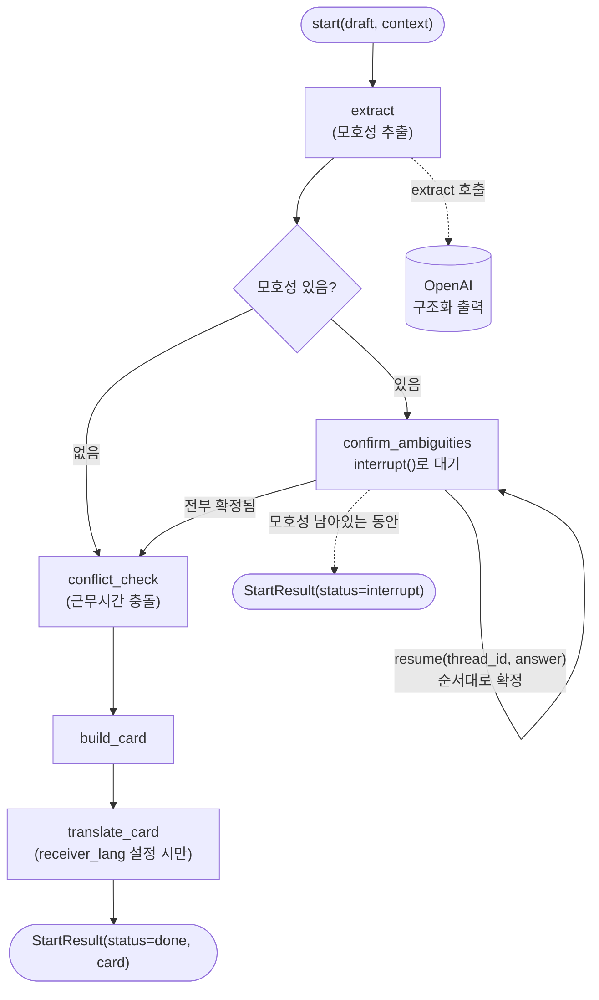

# ditto-agent

발신자 메시지의 시간/의미 모호성을 감지하고, 발신자가 확정할 때까지 멈췄다가(LangGraph
`interrupt()`) 확정되면 "공동 이해 카드"를 만들어 반환하는 에이전트 패키지. 멋쟁이사자처럼
14기 중앙해커톤 "보더리스 협업" 트랙 프로젝트의 AI 모델 파트. FastAPI 라우터/DB/
프론트엔드는 이 패키지 밖(다른 팀원 담당)이며, `start()`/`resume()`/`configure()` 세
함수가 유일한 접점.

## 아키텍처



메시지 하나가 `extract`에서 시작해 모호성 개수만큼(보통 0~2개) `confirm_ambiguities`에서
순서대로 멈췄다 재개되고, 전부 확정되면 `conflict_check`(근무시간 충돌 검사) →
`build_card`(카드 생성) → `translate_card`(수신자 언어 설정 시만 번역)를 거쳐 끝난다.
모호성이 없으면 아예 멈추지 않고 바로 끝까지 진행("모호성이 없으면 경고를 억제" 원칙).

## 설치 & 실행

```bash
cd agent
cp .env.example .env   # DITTO_LLM_MODE=mock이면 OPENAI_API_KEY 없이도 동작
uv sync
uv run pytest
uv run python examples/cli_demo.py   # 서버 없이 터미널에서 전체 흐름 확인
```

## 트랙 경계(Border) 대응

멋쟁이사자처럼 트랙(지리/언어/문화/조직 4개 경계) 기준으로 이 패키지가 실제로 커버하는
범위:

| Border | 대응 | 새 UI 필요? |
|---|---|---|
| 지리 | TIME 카테고리 + `graph/conflict.py`(근무시간 충돌) | 아니오 — 기존 카드의 `기한` 필드 |
| 문화 | REQUEST_INTENT(완곡한 반대 등, 문헌 검증 가장 탄탄함) | 아니오 |
| 조직 | DECISION_STATUS를 `DECISION_STATUS_VOCABULARY`(최종 확정/임시 시도/1차 완료/제안/보류/미정) 6개로 **정규화** — "승인"/"완료"/"컨펌"의 조직별 뜻 차이를 흡수 | 아니오 — 기존 `결정 상태` 필드 |
| 언어 | `DraftContext.receiver_lang` 설정 시 `translate_card_node`가 카드의 자유 텍스트(`task`/`request_type`/`interpretation_note`/`notes`)만 번역, 구조화된 값(타임스탬프·정규화된 상태)은 안 건드림 | 아니오 — 같은 카드 필드, 값만 로컬라이즈 |
| ~~Communicating(OTHER)~~ | **의도적으로 제외** — 골든셋 실측 결과 recall이 다른 카테고리 대비 크게 낮고, 문헌 조사로도 "간접화법/톤 해석은 최고 성능 LLM도 사람 수준 미달"이 확인돼 이번 스코프에서 뺐다 | - |

**번역은 모호성 확정 *이후*에만 한다** — 먼저 번역하면 번역기가 여러 해석 중 하나를
암묵적으로 골라버려서, 발신자가 명시적으로 확정하기 전에 모호성이 사라져버린다(이
프로젝트의 핵심 원칙 위반). `evidence`(원문)는 번역 안 하고 그대로 둔다 — 원문 확인이
필요하면 그쪽을 보면 됨.

## 판단기준표 & 데이터셋 구성

모호성 판단 근거는 `docs/문화_판단기준표_초안.md`의 TIME/REQUEST_INTENT/DECISION_STATUS
16개 항목(OTHER 4개는 위 이유로 제외) — 문헌 조사에 이어 설문(직장인·학생 대상, 세 축
각각 n=12~15)과 한국·호주·미국 근무 경험이 있는 현직 개발자 인터뷰로 1차 검증했다.

이 16개 항목을 기반으로 골든셋(`agent/data/golden.json`, 36케이스)을 만들었다:

| 구성 | 케이스 수 | 설계 |
|---|---|---|
| TIME(T01~T05) | 5쌍(10케이스) | 상대적 기한 표현 vs 명시적 일시 |
| REQUEST_INTENT(F01~F06) | 6쌍(12케이스) | 완곡한 의사표현 vs 명확한 의사표현 |
| DECISION_STATUS(D01~D05) | 5쌍(10케이스) | 조직마다 다른 "완료"의 뜻 vs 정규화된 명시 표현 |
| C02(시간대만 있는 엣지 케이스) | 1쌍(2케이스) | TIME 단독 신호 검증 |
| COMP-01/02 | 2케이스 | 여러 카테고리가 한 메시지에 동시 등장하는 복합 케이스 |

각 쌍은 **ambiguous**(모호성이 있어야 정답) / **explicit**(같은 주제를 완전히 명시적인
표현으로 바꿔 쓴 대조군, 모호성이 없어야 정답)로 구성 — 이 대조 설계 덕분에 recall(진짜
모호한 걸 놓치지 않는지)과 precision(이미 명확한 걸 과탐지하지 않는지)을 golden set
하나로 동시에 측정한다.

## 실험 결과 — 최종 설정과 근거

**최종 채택**: o3-mini + 규칙 기반 TIME 후처리 필터(명시적 시각 문장 오탐 제거, API
호출 없음). 골든셋 36케이스 기준 **recall 0.810 / precision 0.761**.

| 실험 | 조건 | recall | precision | 결론 |
|---|---|---|---|---|
| baseline | o3-mini, 규칙 필터만 | **0.810** | 0.761 | **최종 채택** |
| self-consistency | 위 + 같은 메시지 3회 독립 추출, 카테고리 만장일치 다수결 | 0.746 | **0.825** | recall↓/precision↑ 트레이드오프 확인(반복 측정으로 검증), 응답 지연 3배라 옵션으로만 유지 |
| RAG(동적 few-shot) | 판단기준표 16개를 draft 유사도로 동적 선택 | 0.619~0.762 | 0.619~0.800 | 모든 조합에서 baseline보다 나쁨 — 기각 |

**오해 방지 도구는 recall을 precision보다 우선했다** — 모호성을 놓치는 것(FN)은 조용히
실패해서 나중에 진짜 오해로 이어지지만, 과탐지(FP)는 확인 한 번 더 누르는 정도라
훨씬 덜 치명적이라는 판단.

**방법론적으로 짚을 것**: RAG를 처음 측정했을 때는 recall 1.000/precision 0.875까지
나와 채택할 뻔했으나, golden set의 ambiguous 케이스가 판단기준표 항목의 패러프레이즈로
만들어져 있어서 RAG가 draft와 유사도로 few-shot을 고르면 **자기 자신이 정답으로 그대로
선택되는 유출**이 있었다(17개 중 13개, 76%). leave-one-out(자기 자신 제외)으로 유출을
막고 재측정하니 모든 조합에서 오히려 baseline보다 나빴다 — 후보 풀이 16개뿐이라 "draft와
비슷한 것"과 "카테고리를 골고루 커버하는 것"이 충돌하는 게 원인으로 확인됨(고정
few-shot은 항상 TIME/REQUEST_INTENT/DECISION_STATUS 2-2-2 균형을 유지하지만 RAG는 자주
한 카테고리를 0개로 만든다). self-consistency 트레이드오프도 단일 실행 노이즈와
구분하기 위해 조건당 3회씩 반복 측정(pooled n=108)한 뒤 채택/기각을 결정했다.

precision을 더 우선해야 하는 사용 사례가 생기면(예: 오탐 때문에 사용자 불만이 많다는
QA 피드백) `use_consistency=True`만 켜보는 걸 권장 — 지연시간 3배 증가를 감수할 가치가
있는지 먼저 확인할 것.

## 골든셋 평가 (`ditto-eval`)

```bash
uv run ditto-eval                      # data/golden.json 전체 실행
uv run ditto-eval --limit 3            # 앞 3개만 — 빠른 확인용
uv run ditto-eval --only T01           # id에 "T01"이 포함된 케이스만
uv run ditto-eval --no-cache           # live 모드 캐시 무시하고 매번 새로 호출
uv run ditto-eval --batch-size 20      # 호출 한 번에 20케이스씩 묶기 — 요청 수 자체를 줄임
uv run ditto-eval --consistency 3      # self-consistency(만장일치) 실측용, 기본 파이프라인은 꺼져 있음
uv run ditto-eval --rag                # RAG 동적 few-shot 실측용, 기본 파이프라인은 꺼져 있음
```

**live 모드는 계정 요청 한도(RPD/RPM)에 걸리기 쉽다** — 결제 수단이 없는 계정은
모델마다 한도가 따로 있고 종류도 다르다(대부분 RPD 50/day, o3-mini는 150/day,
gpt-4.1류는 RPD 대신 RPM 3/min). 36개짜리 골든셋 한 번 돌리다 소진된 적이 여러
번 있어서:
- **케이스 여러 개를 호출 하나로 묶어 보낸다**(`LLMClient.extract_batch`, 기본
  `--batch-size 10` — 36개면 4콜) — RPD 자체가 쿼터인 계정에서는 이게 가장 직접적인
  절감. 배치 응답에서 누락된 index가 있으면(모델이 항목을 빠뜨림) 그 케이스만 개별
  `extract()`로 재시도. 이 배치 경로는 **eval 전용**이다 — 실사용(`interface.start()`)은
  항상 메시지 1개라 배칭할 이유가 없어서 안 씀.
- `LLMClient`는 `max_retries=0`으로 OpenAI 클라이언트를 만든다 — 기본 재시도는 429에도
  조용히 백오프하며 재시도해서(호출 하나가 실제로는 HTTP 요청 여러 개) 한도를 더 빨리
  태우고 호출당 수십 초씩 늘어지게 만든다. 빠르게 실패시키는 게 낫다.
- `eval/cache.py`가 live 응답을 `.eval_cache/`(gitignore)에 캐싱한다 — 캐시 키에 시스템
  프롬프트 해시가 들어있어서 `prompts.py`/`culture_criteria.py`를 바꾸면 자동으로
  무효화된다. 같은 골든셋을 반복 실행해도(스코어러만 고친 경우 등) 쿼터를 다시 안 씀.
- rate limit(`RateLimitError`)에 걸리면 남은 케이스는 건너뛰고 그때까지의 결과로
  `report.json`/`.md`를 쓴다 — 이미 쓴 호출이 통째로 버려지지 않는다.

## 통합 인터페이스

```python
from ditto_agent import start, resume
from ditto_agent.schema import DraftContext

result = start(
    draft="이 부분 검토 부탁드려요. 내일까지 조금 더 고민해 보면 좋을 것 같아요.",
    context=DraftContext(
        sender_tz="Asia/Seoul", receiver_tz="America/Los_Angeles", receiver_name="Alex",
        receiver_lang="en",  # 생략하면 카드가 번역 없이 원문 언어 그대로 나감
    ),
)
```

`start()` / `resume()`는 항상 같은 모양의 `StartResult`를 돌려준다:

```python
class StartResult:
    thread_id: str
    status: Literal["interrupt", "done"]
    interrupt: InterruptPayload | None   # status == "interrupt"일 때만
    card: ConfirmedCard | None            # status == "done"일 때만
```

- `status == "interrupt"`: 화면에 `result.interrupt`를 보여주고, 사용자가 고른 답(또는
  직접 입력한 텍스트)을 `resume(result.thread_id, answer)`로 넘긴다. `answer`는
  `result.interrupt.item.candidates` 중 하나를 그대로 넘기거나, 사용자가 직접 입력한
  문자열을 넘겨도 된다(자유 입력 허용).
- `status == "done"`: `result.card`가 최종 "공동 이해 카드" — 그대로 DB에 저장하고
  수신자 화면에 렌더링하면 된다.
- 한 요청은 `thread_id` 하나로 끝까지 추적된다. 추출된 모호성 개수만큼(보통 0~2개,
  드물게 그 이상) 순서대로 멈춘다. `interrupt.step`/`total`로 진행률을 표시할 수
  있다(예: "2/3 확인 중").

### `InterruptPayload`

```json
{
  "step": 1,
  "total": 2,
  "item": {
    "span": "내일까지",
    "category": "TIME",
    "reason": "상대적 기한 표현이라 기준 시각이 명시되지 않음",
    "candidates": ["2026-08-15T18:00:00+09:00", "custom"],
    "suggestion": "'내일까지'의 정확한 기준 시각이 필요합니다 — 08/15 18:00 Asia/Seoul 기준으로 확정할까요?"
  }
}
```

`item.category`가 `TIME`이면 `candidates`는 **ISO8601 절대시각 문자열**(+
`"custom"` — 프론트에서 직접입력 UI로 분기), 그 외(`REQUEST_INTENT` /
`DECISION_STATUS`)는 **자연어 해석 문구**다. 프론트는 `item.category`로 분기해서
렌더링하면 된다.

### `ConfirmedCard` (최종 산출물)

```json
{
  "task": "문서 검토",
  "assignee": "Alex",
  "deadline_confirmed": "2026-08-15T18:00:00+09:00",
  "deadline_receiver_local": "2026-08-15T02:00:00-07:00",
  "request_type": "검토 요청",
  "decision_status": "필수 반영",
  "interpretation_note": "현재 방향 유지 + 세부 보완 요청",
  "notes": [],
  "conflict": {
    "receiver_local_time": "2026-08-15T02:00:00-07:00",
    "within_working_hours": false,
    "note": "수신자 근무시간(09-18 가정) 밖 — 실제 근무시간표는 팀원 모듈에서 조회"
  },
  "evidence": "원문 그대로"
}
```

`deadline_confirmed`는 첫 번째 `TIME` 확인 답, `interpretation_note`는 첫 번째
`REQUEST_INTENT` 확인 답, `decision_status`는 첫 번째 `DECISION_STATUS` 확인 답으로
채워진다(없으면 추출값 그대로). 그 외(같은 카테고리가 여러 번 나온 경우)는 전부
`notes`에 `"[카테고리] 원문 구간: 답변"` 형태로 쌓여 — 어떤 확인 항목도 조용히
버려지지 않는다.

## 프로덕션 배선 (서버 시작 시 1번)

기본값(설정 안 하면)은 로컬 개발용이다: 메모리 체크포인터(서버 재시작하면 진행 중이던
`thread_id`가 날아감) + placeholder 근무시간 충돌 검사(9~18시 하드코딩, 공휴일/실제
근무시간표 미반영). 서버 앱이 뜰 때 한 번 아래처럼 교체한다:

```python
from langgraph.checkpoint.sqlite import SqliteSaver
from ditto_agent import configure

def real_conflict_checker(time_confirmed: str, context) -> ConflictResult:
    ...  # 실제 근무시간/공휴일 DB 조회는 팀원 쪽 모듈

with SqliteSaver.from_conn_string(os.environ["DITTO_CHECKPOINT_DB"]) as checkpointer:
    configure(conflict_checker=real_conflict_checker, checkpointer=checkpointer)
    # 이후 FastAPI 앱 수명 동안 start()/resume()이 이 설정을 씀
```

`conflict_checker`의 시그니처는 `(time_confirmed: str, context: DraftContext) ->
ConflictResult` — `agent/src/ditto_agent/graph/conflict.py`의 `default_conflict_checker`가
참조 구현. 이 체크포인터 DB는 **그래프 재개 상태 전용**이며, 메시지/합의 기록 같은
도메인 데이터는 별도 DB(다른 팀원 쪽)에 저장한다 — 섞지 말 것.

`configure()`는 위 "실험 결과"에서 검증한 정확도 옵션도 받는다 — 기본값을 그대로 두면
되고, 바꿀 일은 거의 없을 것:

```python
configure(
    conflict_checker=real_conflict_checker,
    checkpointer=checkpointer,
    use_verify=False,        # 기본값 — 2차 검수 호출, 실측상 precision 악화라 꺼둠
    use_consistency=False,   # 기본값 — 켜면 recall↓/precision↑ 트레이드오프 + 지연시간 3배
    use_rag=False,           # 기본값 — leave-one-out 검증 후 모든 조합에서 baseline보다 나쁨 확인
)
```

## 환경 변수

| 변수 | 기본값 | 설명 |
|---|---|---|
| `DITTO_LLM_MODE` | **`live`** (코드 기본값) | `mock`이면 키 없이 고정 응답, `live`면 실제 OpenAI 호출. `.env.example`은 로컬 개발용으로 `mock`을 명시해둠 — 이 변수 자체를 안 정하면(예: 배포 환경 설정 누락) `live`로 시도하다 `OPENAI_API_KEY` 없으면 바로 에러 — 조용히 mock으로 새는 것 방지 |
| `OPENAI_API_KEY` | (없음) | `live` 모드에서 필수 |
| `DITTO_OPENAI_MODEL` | `o3-mini` | 구조화 출력을 지원하는 모델로 교체 가능. 결제 수단이 없는 계정은 모델별로 무료 티어 한도가 서로 다르다(RPD 50/day가 대부분이지만 o3-mini는 150/day, gpt-4.1류는 RPD 대신 RPM 3/min이 병목) — 계정에 결제 수단을 등록하면 전체 한도가 올라간다 |
| `DITTO_CHECKPOINT_DB` | `./ditto_checkpoints.db` | `SqliteSaver` 배선 시 사용할 경로 |

## 아직 안 채운 부분

- 판단기준표 16개 항목은 설문(n=12~15)·인터뷰 1차 검증은 됐지만, 실사용 트래픽
  기반 검증은 아직 없음.
- 골든셋이 36케이스로 표본이 작아 recall/precision 절대값에 노이즈가 크다(같은
  설정으로 반복 측정해도 ±0.05~0.1 흔들림 확인됨) — **QA 기간 동안 골든셋을
  확장**해서(few-shot 풀과 안 겹치는 새 문장으로, 정답 유출 방지) 더 큰 표본으로
  재검증할 계획.
- `graph/conflict.py`의 `default_conflict_checker`는 진짜 근무시간표/공휴일을 모른다
  — 프로덕션에서는 반드시 `configure(conflict_checker=...)`로 교체.
- `translate_card_node`는 카드 필드만 번역 — 채팅 스레드의 개별 메시지 번역은 스코프
  밖(팀원 프론트 쪽 관심사일 수 있음).
